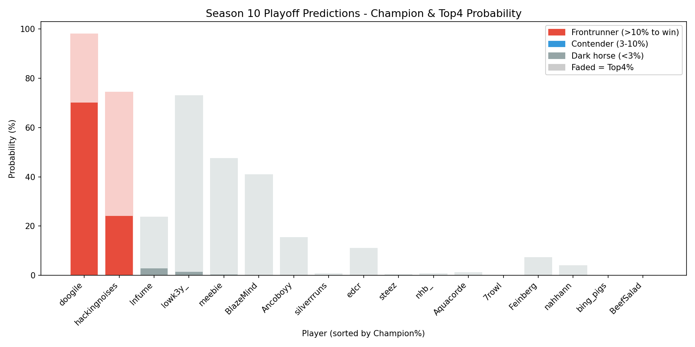
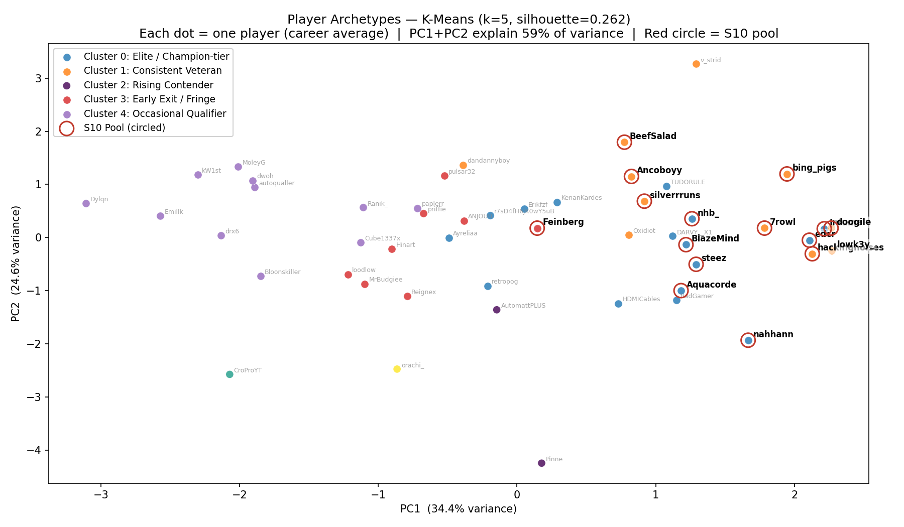
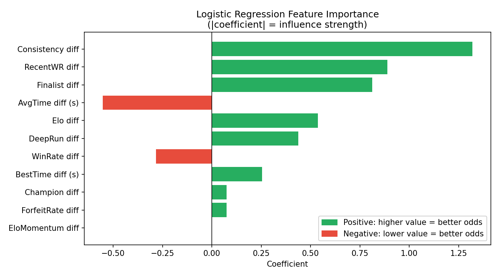
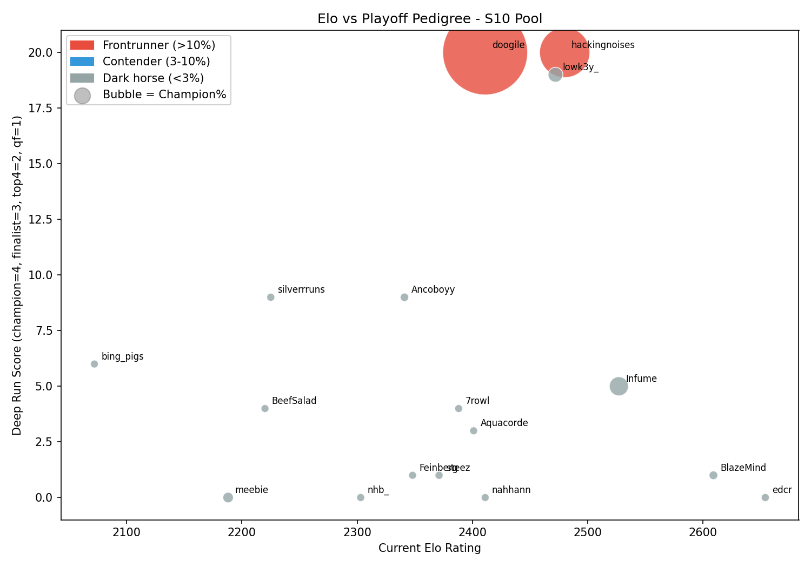
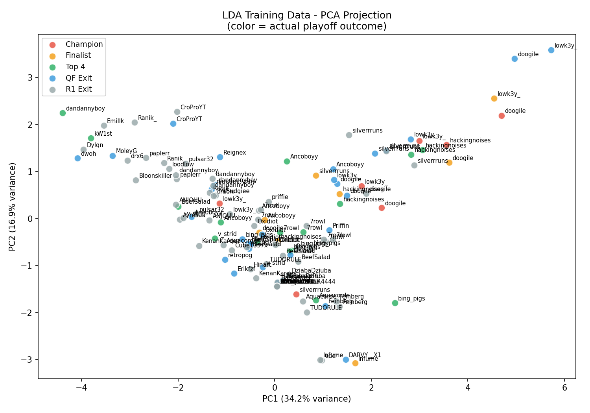

# MCSR Ranked Playoff Prediction

Predicting the Season 10 Minecraft Speedrunning Ranked (MCSR) playoff bracket
using nine seasons of historical ranked match data, classical ML models, and
Monte Carlo simulation.

**Course:** DADS 7275 — Northeastern University, Final Project
**Author:** Hiroshima S



## Motivation

MCSR Ranked is a competitive 1-vs-1 Minecraft speedrunning ladder. Each season
ends with a 16-player playoff bracket. Given ~11,000 ranked matches across 9
seasons, can we predict who wins Season 10?

The project tries to answer three questions:

1. **Are there distinct player archetypes** in the playoff pool? (KMeans + PCA + t-SNE)
2. **Which features actually drive playoff outcomes?** (Logistic Regression + LDA)
3. **Who is most likely to win Season 10?** (Monte Carlo simulation of the bracket)

## Tech Stack

- **Languages:** Python 3.10+, SQL, Cypher
- **ML / data:** pandas, scikit-learn, numpy
- **Databases:** MySQL (relational) and Neo4j (graph) — same MCSR data modeled in both paradigms
- **Viz:** matplotlib, seaborn
- **Notebook:** Jupyter + ipywidgets

## Methodology

| Step | What | Why |
|---|---|---|
| Scraping | `src/scraper.py` pulls player profiles, matches, head-to-head and bracket data from the public [MCSR Ranked API](https://api.mcsrranked.com) | Reproducible data source, no auth required |
| Feature engineering | 11 features per player: Elo, win rate, recent form, consistency, finish times, forfeit rate, Elo momentum, tournament pedigree | Mix of skill, speed, reliability, and history signals |
| Unsupervised | KMeans on career-average features, visualized via PCA and t-SNE | Find player archetypes ("Elite", "Veteran", "Rising", "Early Exits") |
| Supervised | Logistic Regression on pairwise tier comparisons; LDA on individual-player outcome classes | Predict head-to-head winners; classify each player into a likely bracket placement |
| Validation | Train on Seasons 1–8, hold out Season 9. Recency-weighted training (recent seasons matter more) | Avoid data leakage; test predictive power on truly unseen data |
| Simulation | 10,000-run Monte Carlo of the S10 bracket using LR win probabilities | Convert per-match probabilities into per-player championship odds |
| Relational DB | MySQL schema for player profiles, match history, and time records; 10 SQL pattern queries (JOIN, subqueries, aggregations, UNION, EXISTS, ALL) | Demonstrates ability to design and query structured data |
| Graph DB | Neo4j model treating players, matches, and tournaments as connected nodes; Cypher queries for relationship traversal | Demonstrates alternative data modeling paradigms for the same problem |

## Selected Results

| Plot | Insight |
|---|---|
|  | KMeans finds 4 clear archetypes; S10 pool players (red circles) cluster in the Elite / Veteran regions |
|  | Finish-time consistency, recent win rate, and finalist appearances are the strongest predictors of head-to-head outcomes; Elo and overall pedigree contribute at roughly half that weight |
|  | High Elo does not always equal championship pedigree — separation is informative |
|  | LDA cleanly separates champion / finalist / top-4 outcomes in PCA-projected feature space |

## How to Run

Requires Python 3.10+.

```bash
git clone <repo-url>
cd "DADS7275-final-project"

# Install dependencies
pip install -r requirements.txt

# Option A: open the notebook (recommended — contains the full story)
jupyter notebook mcsr_playoff_prediction.ipynb

# Option B: run individual scripts
python src/scraper.py                  # re-scrape raw data (~30 min, optional)
python src/analysis.py                 # EDA + KMeans/t-SNE/PCA -> data/processed/
python src/logistic_regression_eval.py # Train S1-8, evaluate on S9 hold-out
python src/predict_s10.py              # Generate S10 predictions + simulation
```

The repository ships with all scraped data committed under `data/raw/`, so the
notebook reproduces end-to-end without re-running the scraper.

## Project Structure

```
.
├── mcsr_playoff_prediction.ipynb   # Main notebook — full analysis with outputs
├── src/
│   ├── features.py                 # Shared feature engineering (single source of truth)
│   ├── scraper.py                  # MCSR Ranked API scraper (S1-S9)
│   ├── explore_api.py              # Quick API smoke-test helper
│   ├── analysis.py                 # EDA, feature engineering, KMeans/t-SNE/PCA
│   ├── logistic_regression_eval.py # S1-8 train / S9 hold-out evaluation
│   └── predict_s10.py              # S10 prediction pipeline + Monte Carlo
├── data/
│   ├── raw/                        # Per-season JSON + combined CSVs (from scraper)
│   └── processed/                  # Flat CSVs and all chart PNGs
├── tests/                          # Unit tests + notebook drift test
├── scripts/
│   └── make_baseline.py            # Regenerates the feature fixture
├── requirements.txt
├── LICENSE                         # MIT
└── README.md
```

## Data

All data comes from the public **[MCSR Ranked API](https://api.mcsrranked.com)**.
No authentication or API key is required. The scraper respects the published
rate limit (500 requests per 10 minutes).

## Companion SQL work

This repo also contains relational + graph (Neo4j) modeling of the same MCSR
Ranked data, completed for DADS 6700 — see [sql/](sql/) for the 9-table
schema, ETL, example queries, and a small charting dashboard.

## License

[MIT](LICENSE) — feel free to use this code or analysis approach for your own
projects.

## Acknowledgements

- The MCSR Ranked team for maintaining a public, well-documented API.
- The MCSR community for providing nine seasons of competitive data to learn from.
